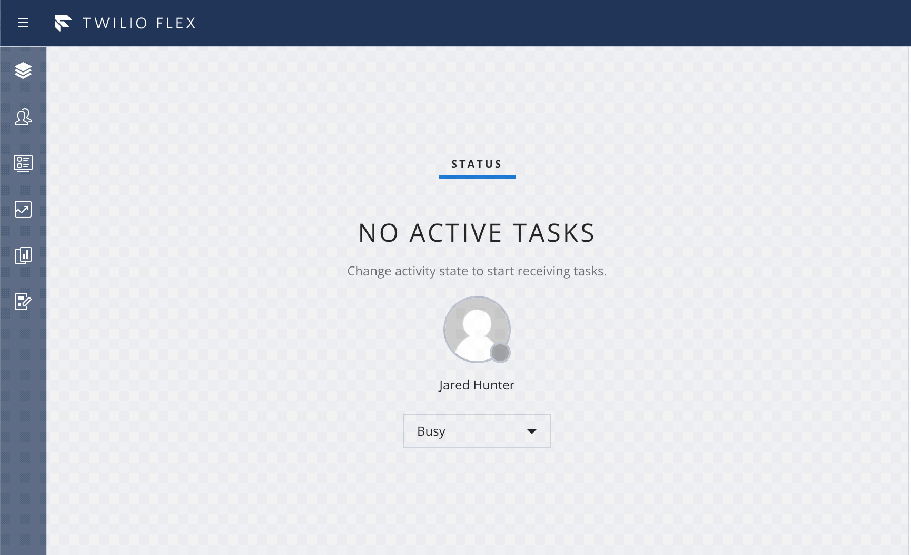

# omni-channel-capacity-management

This feature is intended for use when the solution imposes the following parameters

- chat and other channels are mututally exclusive (using workflow expressions, see below)
- chat users have a capacity greater than 1

The reason for this is; if for example voice has a capacity of 1 and chat has a capacity of 2 and there is a backlog of chat work, the agent would be locked into doing that chat work as each time a chat task is dismissed, another chat task would take its place. This means that the chat backlog would
need to be exhausted before the user would ever qualify for voice work.

To address this, this feature toggles agents between a chat capacity of 2 and chat capacity of 1 ensuring taskrouter can route the most important piece of work to the user, across both channels.

# flex-user-experience

Example delivery of callbacks (on voice channel of capacity 1) and chat tasks (max capacity 2) where the task backlog is ordered callback, chat, callback, chat, callback, chat, callback, chat, callback

# setup and dependencies

1. Make sure the feauter is enabled in the flex-config

2. Ensure that for your workflows assinging work, they use the relevant workflow expression.

&ensp;&ensp;&ensp;&ensp;&ensp;For example for workflows assinging chat work to queues
 &ensp;&ensp;&ensp;&ensp;&ensp;&ensp;- worker.channel.voice.available_capacity_percentage == 100
 &ensp;&ensp;&ensp;&ensp;&ensp;For workflows assinging voice work to queues
 &ensp;&ensp;&ensp;&ensp;&ensp;&ensp;- worker.channel.chat.available_capacity_percentage == 100
 &ensp;&ensp;&ensp;&ensp;&ensp;If other channels are in use, then modify accordingly

# how does it work?

By using the workflow expressions to keep reservations of different channels mutually excluded, the solution works by moving the agents channel capacity to 1 anytime they hit their max capacity. Then this allows taskrouter to assign the next relevant piece of work. As soon as that work is accepted, this feature automatically puts their capacity back to 2. Further enhancements would need to be made to this feature if each agent was to have a different max capacity.
